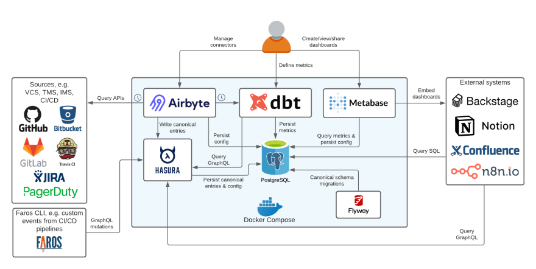

# Synchronizing Google Sheets to PostgreSQL via Airbyte and Visualizing Insights with Metabase



# Description
This documentation provides a comprehensive guide on configuring Airbyte within a Docker container to seamlessly synchronize data from Google Sheets to a local PostgreSQL database. Additionally, it offers step-by-step instructions to establish a connection between the synced data and Metabase for insightful analysis and reporting.

# Deploy Airbyte on your local machine
### Setup and launch Airbyte on Mac
* Install Docker Engine and the Docker Compose plugin on your workstation.You can check on youtube on how to Install docker on your local machine.
* After Docker is installed, you can immediately get started locally by running:
```
### clone Airbyte from GitHub
git clone --depth=1 https://github.com/airbytehq/airbyte.git

### switch into Airbyte directory
cd airbyte

### start Airbyte
./run-ab-platform.sh
```
In your browser, visit http://localhost:8000

You will be asked for a username and password. By default, username:airbyte and password:password. Once you deploy Airbyte to your servers, be sure to change these in your .env file:
``` 
# Proxy Configuration
# Set to empty values, e.g. "" to disable basic auth
BASIC_AUTH_USERNAME=your_new_username_here
BASIC_AUTH_PASSWORD=your_new_password_here
```
## Setup and launch Airbyte on Windows
After installing the WSL 2 backend and Docker you should be able to run containers using Windows PowerShell. Additionally, as we note frequently, you will need docker-compose to build Airbyte from source. The suggested guide already installs docker-compose on Windows.
Install [Docker Desktop](https://docs.docker.com/desktop/install/windows-install/) from here.

Make sure to select these options:
* Enable Hyper-V Windows Features
* Install required Windows components for WSL 2 when prompted. After installation, it will require to reboot your computer.
* You're done!

```
git clone --depth=1 https://github.com/airbytehq/airbyte.git
cd airbyte
bash run-ab-platform.sh
```

In your browser, just visit http://localhost:8000
You will be asked for a username and password. By default, that's username airbyte and password password. Once you deploy airbyte to your servers, be sure to change these.
Start moving some data!

# Setup your first data source on Airbyte(Google sheet)
Before you create a new source on airbyte, you would have to create your google sheet API before.
### How to create google sheet API.
* You need to setup your google platform account [here](https://console.cloud.google.com/) if you don't have one already.
* Enable your google sheet API on your google cloud platform. How?; In the search bar, search for **Google sheet API** then click enable.
* You can also enable your Google drive API using the same steps.
### Create your service account.
NB; The service account will generate the credentials that will use to access google sheet.
On the cloud console, click on;
* Credentials
* Create credentials
* Service account

#### Under service account details;
* Service account name : Airbyte
* Service account ID : Airbyte
* After that click on create and continue 
* Select role and choose owner
Click continue and click done and you have your service account setup. Also don't forget service account email because you will need it again.

### Create your service account key
After setting up your service account, click on;
* The email to create your key
* Add key
* Create new key
* Choose JSON is the key type and click create.
Automatically your key will be downloaded so make sure you check your downloads because you will use that key for authentication on airbyte to source your data from google sheet.

### Share your google sheet data with your service account email
* Copy your service email
* Go to google sheet where your source data is located
* On the top right corner, you will see share 
* Click on share and paste your service account email. Make sure you give it an editor access.

### Now that you have your authentication key, go back to Airbyte to connect your *Google sheet*;
* On the Airbyte platform, click connections 
* At the top right corner, click new connection
* Set up new source
* Search for google sheet 
* For Source name, enter a name to help you identify this source; In this case, **Google sheet**
* Under authentication, click on the dropdown to select **Service account key authentication**
* Go to your downloads and open the key that you downloaded whilst creating your service account key, copy it and paste it under **service account information**
* For **Spreadsheet Link**, enter the link to the Google spreadsheet. To get the link, go to the Google spreadsheet you want to sync, click *Share* in the top right corner, and click **Copy Link**.
* (Optional) You may enable the option to Convert Column Names to SQL-Compliant Format. Enabling this option will allow the connector to convert column names to a standardized, SQL-friendly format. For example, a column name of Café Earnings 2022 will be converted to cafe_earnings_2022. We recommend enabling this option if your target destination is SQL-based (ie Postgres, MySQL). Set to false by default
* Click Set up source and wait for the tests to complete.

## Create a Postgres instance on docker 
You need to create a Postgres instance on docker like we did for Airbyte as your destination to store data sync from Airbyte.
Run this command on docker to create your airbyte-Postgres container on docker;
```
docker run --rm --name airbyte-postgres -e POSTGRES_PASSWORD=password -p 3000:5432 -d postgres
```
Your airbyte-postgres should be up and running on docker.
### Now go back to Airbyte to connect your destination to the source with the following details.

* In the left navigation bar, click Destinations. In the top-right corner, click new destination.
* On the Set up the destination page, enter the name for the Postgres connector and select Postgres from the Destination type dropdown.
* Enter a name for your source.
##### For the Host, Port, and DB Name, enter the hostname, port number, and name for your Postgres database.
* List the Default Schemas.
##### The schema names are case sensitive. The 'public' schema is set by default. Multiple schemas may be used at one time. No schemas set explicitly - will sync all of existing.
```
DATABASE_USER=postgres
DATABASE_PASSWORD=password
DATABASE_HOST=host.docker.internal # refers to localhost of host
DATABASE_PORT=3000
DATABASE_DB=postgres
```

### Setup the Configuration
* Schedule type should be set to schedule if you want Airbyte to sync your data Automatically based on the duration you set. 
If you set it to manual, you would have sync your data manually any time you update your data.
* Replication frequency; the duration you want your data to sync to your database.
* Destination Namespace; If you leave it, Airbyte will give your schema a default name eg. "public". If you wannt to give your schema a prefered name, 
1. click on edit
2. Go to custom and type the prefered name eg. Knexis. If you put it like "Knexis" its going to show like _ Knexis _ in your database.
Now that everything is set, you have to see the physical data in our postgres db so you can do your analysis with it.
# Set up your PGAdmin4 in docker
* Open your docker
* In the left navigation bar, click **Extensions**
* Search and download PGAdmin4
* Open PGAdmin4 and create your first server with the ff details;
* Right click on server
* Register 
* Server 
* Under General just give any name you want to use as your server
* Under connections, use the details below and save.
```
Name = postgres
DATABASE_PASSWORD = password
DATABASE_HOST=host.docker.internal 
DATABASE_PORT=3000
DATABASE_DB=postgres
```
You should see your data under the server you just created.

# Running Metabase on Docker v0.48
### Assuming you have Docker installed and running, get the latest Docker image:
```
docker pull metabase/metabase:latest
```
Then start the Metabase container:
```
docker run -d -p 3000:3000 --name metabase metabase/metabase
```
To run your Open Source Metabase on a different port, that is when port 3000 is in use already, you can use something like 12345;
```
docker run -d -p 12345:3000 --name metabase metabase/metabase
```
Once startup completes, you can access your Open Source Metabase at http://localhost:12345
 # Connect your database to Metabase
 * At the top right corner on your Metabase homepage,click the select button 
 * Select Admin
 * Select Metabase from the options at the top
 * On your top right cornor, select add database 
 * Put in the details of the database we created on docker**(PGAdmin4)**
 * Click on save and you are good to go!

 #### Glad to receive your feedbacks.


